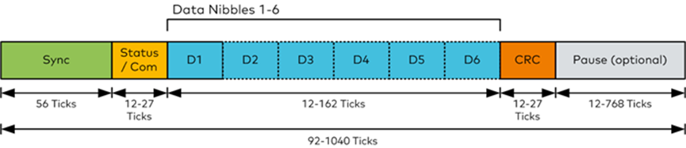

# SENT协议指导手册
## 文档概述
本文为SENT协议的相关协议信息的收集整理汇总，意图让读者通过本文能够较为详尽的了解SENT协议并进行相关的开发与测试。
## SENT协议概述
### 概述
SENT 全称Single Edge Nibble Transmission，中文名称为“单边半字传输协议”，是SAE推出的一种点对点的、单向传输的方案，被用于车载传感器和电子控制单元（ECU）之间的数据传输。
### 协议特点
1.	单线传输
2.	电平信号
3.	数据单向从传感器到ECU
4.	数据包为“帧”，每帧由多个半字节数据组成，称为“Nibble”。
5.	数据的传输可以分为快速通道和慢速通道，重要的信号用快速通道以实现高频率的更新，比如压力等，对于非关键的信号，如诊断等可以放在慢速通道传输；快速通道是每一帧传输一个完整的信号，慢速通道需要使用多帧传输一个完整的信号，即更新频率不同[^1]；
6.	发送数据的时间由传感器的时钟决定；
## SENT协议物理层
### 原理图
SENT传感器与ECU的基本线路连接如下图。

### 信号电平
如图所示，0-0.5V为逻辑电平0，4.1-5V为逻辑电平1[^3]。信号使用单总线传输。

## SENT信号帧解析（数据链路层）
### 概述
SENT信号通过两个下降沿周期之间的一系列脉冲序列来传输，SENT报文以一个同步脉冲开始，该脉冲与后续的下降沿之间的时间间隔等效于56个时钟节拍；同步脉冲之后，状态/通信半字节按照SENT格式传送；随后紧接着就是6个含有传感器数据的Data Nibbles，数据通过4个数据位为一个单元来传输，或称“半字节”（一个半字节即一个Nibble）；在每条报文的尾部会提供一个检验脉冲并插入一个固定长度不超过1ms的暂停脉冲，因此SENT报文的长度会随着半字节的值而有不同[^4]。
### Nibble解析
SENT协议的数据使用半个字节Nibble，即4bit来进行编码定义的，单个半字节Nibble是通过2个下降沿之间的时间差来定义的。如下是一个Nibble的电压逻辑信号。

时间精度以1个节拍Tick来定义（一般1个Tick的时间是3~10us），每一个Nibble从一个下降沿开始，并且之后在逻辑0状态至少维持4Ticks，之后下一个下降沿距离第一个下降沿的时间差作为Nibble值的编码依据。需要注意的是，后一个下降沿距离第一个下降沿至少相隔12Ticks，至多27Ticks，且相隔Tick数减去12即为最终的Nibble值，如此Nibble值最小为0，最大为15（27Tick-12Tick），二进制表示时即为4bit[^3]。
### SENT基本帧结构

基本组成[^3]：
|组成部分|
名称
|解释|
| -------- | -------- | -------- |
|Sync|标定/同步脉冲|固定的56Ticks，不是按照标准的SENT数据格式发送，该脉冲与后续的下降沿之间的时间间隔等效于56个时钟节拍。|
|Status/Com|状态及通讯字段|12-27Ticks，即1个Nibble（4bit）|
|Data|数据段|12-162Ticks，即1-6个Nibble|
|Pause|暂停脉冲|12-768Ticks，早期的SENT协议无此字段或者一个固定长度Ticks，SENT2010之后，部分通过此功能可以动态调节TICKS的个数，实现整个SENT协议是同一个固定长度TICKS|
### 一个例子
举个例子，将SENT协议通信抽象为用手电筒传递信息，则通信过程如下。
首先约定：A每次点亮手电筒时，B按下秒表计时，A将信息藏于时间。B根据“密码本”对照看每次点灯时间长度来查找对应字母。于是，A不停的亮灯，灭灯，亮灯灭灯。B根据A亮灭灯来掐表，对照密码本看是什么字母。由于AB手里的秒表时基不同，彼此时间并不同步。为了解决这个问题，AB又约定：A每次发送信息，都会持续点亮56秒，然后A再发送数据。这56秒是给B对表用的。
于是，B接收到A的56秒数据时，都会同步自己的秒表，这样就能确保A的时间刻度和B时间刻度保持一致，查密码本时就不会出错。
但手电筒传递过程中，偶尔出现恶劣情况或有飞沙掠影，B可能看到A的灯光“虚闪”，这样的话，B掐表就会出现紊乱。
为了解决这个问题，AB约定：A每次发送完信息后，再发送一个验证码，验证码是由前面的信息反算得来。即A每次发送的信息都会有一套加密算法得到一组验证码，A再将验证码发送出去。B接收到信息后，也会接收到验证码，同时B根据相同算法将接收的数据转换得到一组验证码，将计算得到的验证码和接收到的验证码比较，一致说明信息正确，不同则丢弃数据。
简单总结就是：对表、计时和验证，这也就是SENT协议传输的全过程[^5]。
### SENT的Tick时间定义与Sync机制
如上文所示，SENT的Tick长度可以在3~10us之间。那如何确定Tick长度呢？如果一个帧内的Tick长度不同，显然会导致解析错误。因此，SENT协议在帧头部设置了Sync同步域，Sync包含1个下降沿，该下降沿到下一个下降沿（Status/Com）的间隔时间为56个Ticks的时间，以此对Tick时长进行标定[^2]。
假设一个Tick长度为5us，则Sync域的长度将为280us，也就是Sync的下降沿到Status/Com的下降沿之间的时间间隔为280us。
### Status/Com域
Status/Com域仅包含一个Nibble，长度为4bit。该域的数据主要用于单个报文中多帧的组合控制，具体的定义与使用使用详见章节“SENT多帧报文（类同网络层）”。
### CRC校验字段
该字段用于对数据进行CRC校验，长度为12~27Ticks，即一个Nibble。
CRC种子为5，生成多项式为[^6]：
$$
x^4+x^3+x^2+1
$$
CRC表为：\{0, 13, 7, 10, 14, 3, 9, 4, 1, 12, 6, 11, 15, 2, 8, 5\}
### Pause暂停脉冲
暂停脉冲为可选项，长度为12~768Ticks。早期的SENT协议无此字段或者一个固定长度Ticks，SENT2010之后，部分通过此功能可以动态调节TICKS的个数，实现整个SENT协议是同一个固定长度TICKS[^3]。
## SENT多帧报文
### 概述
SENT协议的高级功能是将多帧报文组合以实现更高复杂的通信功能，一般用于传输传感器的附加信号，比如温度，故障码和传感器类型信息等。SENT协议提供“Short Serial Message”（短消息）与“Enhanced Serial Message”（增强型消息）2种多帧组合报文功能[^3]。
### Short Serial Message

当Status/Com字段的bit3值为1，其之后的15帧SENT报文的Status/Com字段的bit3值都为0时，即为此种情况，此情况下是16帧SENT报文组合来传输附加信息。
Status/Com字段的bit3值用来辨别以何种形式组合，而这16帧SENT报文的Status/Com字段的bit2值组合起来的16bit的值即为组合传输的信息，其由4-bit的Message ID，8-bit的Data和4-bit的CRC组成[^3]。
### Enhanced Serial Message

与上一种情况不同的是，此情况下使用18帧SENT报文组合来传输附加信息，起始标志是Status/Com字段bit3连续为1111110，并且要求Status/Com字段bit3组合的第13和第18位都为0。
而数据域依然由18帧SENT报文的Status/Com字段的bit2值组合而成，但其数据组成又根据Status/Com字段bit3组合的第8位的不同分为2种情况[^3]。
### Status/Com字段bit3组合的第8位为0
Status/Com字段bit3组合的9~12bit和14~17bit分别作为8bit ID的高4位和低4位数据，而Status/Com字段bit2组合的1~6bit是6bit的CRC数据，之后的7~18bit则为要传输的12bit的数据[^3]。

### Status/Com字段bit3组合的第8位为1
Status/Com字段bit3组合的9~12bit为4bit ID，而Status/Com字段bit2组合的1~6bit是6bit的CRC数据，之后的7~18bit和bit3组合的14~17bit则组合为要传输的16bit的数据[^3]。

[^1]:[AUTOSAR MCAL系列之SENT信号传输 - 知乎 (zhihu.com)](https://zhuanlan.zhihu.com/p/338810986)
[^2]:[有没有大神懂 SENT通信协议解析的，用来做调试和上位机测试？ - 测控道的回答 - 知乎](https://www.zhihu.com/question/471560747/answer/2336679984)
[^3]:[SENT协议_canoe搭建sent传感器工程-CSDN博客](https://blog.csdn.net/sinea2011/article/details/103927523)
[^4]:[SENT信号介绍 - 知乎 (zhihu.com)](https://zhuanlan.zhihu.com/p/87250091)
[^5]:[汽车通信总线（五）——SENT总线介绍 - 汽车电子技术 - AutoEE.cn](https://www.autoee.cn/article/618.html)
[^6]:[communication - SENT CRC calculation - Electrical Engineering Stack Exchange](https://electronics.stackexchange.com/questions/284195/sent-crc-calculation)